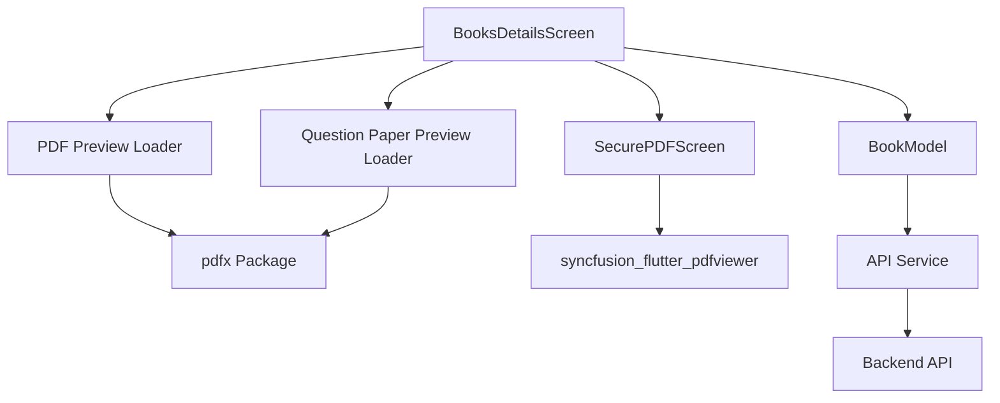

# Design Document: Question Paper Preview

## Overview

This design extends the AcademixStore Flutter application to support question paper previews alongside book previews. The implementation follows the existing architecture patterns used for book PDF previews and secure viewing, ensuring consistency in both functionality and user experience.

The feature adds question paper support through three main components:
1. **Data Model Extension**: Adding question paper URL fields to the BookModel
2. **Preview Rendering**: Loading and displaying the first page of question paper PDFs
3. **Secure Viewing**: Opening question papers in the existing SecurePDFScreen with full security protections

The design maintains backward compatibility with existing API responses and gracefully handles cases where question papers are not available.

## Architecture

### Component Overview



### Data Flow

1. **Loading Phase**:
   - API returns book data including optional question paper URLs
   - BookModel parses and stores question paper URLs
   - BooksDetailsScreen initializes and loads both book and question paper previews in parallel

2. **Display Phase**:
   - Book preview section renders first (existing functionality)
   - Question paper preview section renders below book preview (if available)
   - Both previews show loading states independently

3. **Viewing Phase**:
   - User taps on question paper preview
   - System validates question paper URL
   - SecurePDFScreen opens with question paper URL and user watermark
   - Security protections activate (screenshot prevention, watermark overlay)

### State Management

The BooksDetailsScreen will manage two independent preview states:
- `_firstPageImage`: Existing state for book PDF preview
- `_questionPaperFirstPageImage`: New state for question paper preview
- `_loading`: Existing state for book preview loading
- `_loadingQuestionPaper`: New state for question paper preview loading

## Components and Interfaces

### 1. BookModel Extension

**Location**: `lib/Core/home/model/book_model.dart`

**New Fields**:
```dart
class BookModel {
  // ... existing fields ...
  String? questionPaperUrl;
  String? questionPaperAccessUrl;
  
  // Constructor update
  BookModel({
    // ... existing parameters ...
    this.questionPaperUrl,
    this.questionPaperAccessUrl,
  });
}
```

**JSON Parsing**:
```dart
BookModel.fromJson(Map<String, dynamic> json) {
  // ... existing parsing ...
  questionPaperUrl = json['question_paper_url'];
  questionPaperAccessUrl = json['question_paper_access_url'];
}
```

**JSON Serialization**:
```dart
Map<String, dynamic> toJson() {
  // ... existing serialization ...
  data['question_paper_url'] = questionPaperUrl;
  data['question_paper_access_url'] = questionPaperAccessUrl;
  return data;
}
```

### 2. BooksDetailsScreen Extension

**Location**: `lib/Core/home/view/books_details_screen.dart`

**New State Variables**:
```dart
class _BooksDetailsScreenState extends State<BooksDetailsScreen> {
  // ... existing state ...
  PdfPageImage? _questionPaperFirstPageImage;
  bool _loadingQuestionPaper = true;
}
```

**New Methods**:

**a) Load Question Paper Preview**:
```dart
Future<void> _loadQuestionPaperFirstPage(String pdfUrl) async {
  if (pdfUrl.isEmpty) {
    setState(() => _loadingQuestionPaper = false);
    return;
  }

  final url = pdfUrl.replaceAll(RegExp(r'\s+'), '');

  try {
    final response = await http.get(Uri.parse(url));
    if (response.statusCode == 200) {
      final document = await PdfDocument.openData(response.bodyBytes);
      final page = await document.getPage(1);

      final pageImage = await page.render(
        width: 800,
        height: 1200,
        format: PdfPageImageFormat.png,
      );
      await page.close();

      setState(() {
        _questionPaperFirstPageImage = pageImage;
        _loadingQuestionPaper = false;
      });
    } else {
      print("Failed to load question paper PDF: ${response.statusCode}");
      setState(() => _loadingQuestionPaper = false);
    }
  } catch (e) {
    print("Error loading question paper preview: $e");
    setState(() => _loadingQuestionPaper = false);
  }
}
```

**b) Open Question Paper Viewer**:
```dart
Future<void> _openQuestionPaperViewer() async {
  final pdfUrl = widget.bookPdfurl ?? ''; // Will be updated to use question paper URL
  
  if (pdfUrl.isEmpty) {
    _showErrorDialog('Question paper URL not available');
    return;
  }

  try {
    log('Opening question paper viewer for book: ${widget.bookId}');

    if (mounted) {
      Navigator.push(
        context,
        PageRouteBuilder(
          pageBuilder: (context, animation, secondaryAnimation) =>
              SecurePDFScreen(pdfUrl: pdfUrl, watermarkText: userId),
          transitionsBuilder: (context, animation, secondaryAnimation, child) {
            return FadeTransition(opacity: animation, child: child);
          },
          transitionDuration: const Duration(milliseconds: 300),
        ),
      );
    }
  } catch (e) {
    log('Error opening question paper viewer: $e');
    _showErrorDialog('Error loading question paper: $e');
  }
}
```

**c) Build Question Paper Preview Widget**:
```dart
Widget _buildQuestionPaperPreview(bool isDark) {
  // Only show if question paper URL exists
  if (widget.bookQuestionPaperUrl == null || widget.bookQuestionPaperUrl!.isEmpty) {
    return const SizedBox.shrink();
  }

  return Column(
    crossAxisAlignment: CrossAxisAlignment.start,
    children: [
      Text(
        'Question Paper Preview',
        style: GoogleFonts.poppins(
          color: AppColors.primaryGold,
          fontSize: 16.sp,
          fontWeight: FontWeight.w600,
        ),
      ),
      SizedBox(height: 1.h),
      GestureDetector(
        onTap: _openQuestionPaperViewer,
        child: AbsorbPointer(
          absorbing: true,
          child: Container(
            padding: EdgeInsets.all(4.w),
            decoration: AppColors.glassmorphicDecoration(
              borderRadius: 16,
              isDark: isDark,
            ),
            child: Stack(
              children: [
                Center(
                  child: _loadingQuestionPaper
                      ? Column(
                          children: [
                            CircularProgressIndicator(
                              color: AppColors.primaryGold,
                            ),
                            SizedBox(height: 2.h),
                            Text(
                              'Loading question paper preview...',
                              style: GoogleFonts.poppins(
                                color: AppColors.getTextSecondary(isDark),
                                fontSize: 12.sp,
                              ),
                            ),
                          ],
                        )
                      : _questionPaperFirstPageImage != null
                          ? ClipRRect(
                              borderRadius: BorderRadius.circular(12),
                              child: Image.memory(
                                _questionPaperFirstPageImage!.bytes,
                                width: double.infinity,
                                fit: BoxFit.contain,
                              ),
                            )
                          : Column(
                              children: [
                                Icon(
                                  Icons.quiz_rounded,
                                  color: AppColors.primaryGold,
                                  size: 30.sp,
                                ),
                                SizedBox(height: 1.h),
                                Text(
                                  'Preview not available',
                                  style: GoogleFonts.poppins(
                                    color: AppColors.getTextSecondary(isDark),
                                    fontSize: 12.sp,
                                  ),
                                  textAlign: TextAlign.center,
                                ),
                              ],
                            ),
                ),
                if (_questionPaperFirstPageImage != null)
                  Positioned.fill(
                    child: Center(
                      child: Opacity(
                        opacity: 0.3,
                        child: Transform.rotate(
                          angle: -0.5,
                          child: Text(
                            'PREVIEW ONLY',
                            style: GoogleFonts.poppins(
                              fontSize: 24.sp,
                              fontWeight: FontWeight.bold,
                              color: AppColors.primaryGold,
                            ),
                          ),
                        ),
                      ),
                    ),
                  ),
              ],
            ),
          ),
        ),
      ),
      SizedBox(height: 3.h),
    ],
  );
}
```

**Initialization Update**:
```dart
@override
void initState() {
  super.initState();
  _currentPurchaseStatus = widget.isPurchased ?? 0;
  _enableScreenSecurity();
  _loadFirstPage(widget.bookPdfurl ?? '');
  _loadQuestionPaperFirstPage(widget.bookQuestionPaperUrl ?? ''); // New line
  _initializeRazorpay();
  getUserId();
}
```

### 3. BooksDetailsScreen Constructor Extension

**New Parameters**:
```dart
class BooksDetailsScreen extends StatefulWidget {
  // ... existing parameters ...
  final String? bookQuestionPaperUrl;

  const BooksDetailsScreen({
    super.key,
    // ... existing parameters ...
    this.bookQuestionPaperUrl,
  });
}
```

### 4. Navigation Updates

When navigating to BooksDetailsScreen from other screens (HomeScreen, BookmarksScreen, etc.), pass the question paper URL:

```dart
Navigator.push(
  context,
  MaterialPageRoute(
    builder: (context) => BooksDetailsScreen(
      // ... existing parameters ...
      bookQuestionPaperUrl: book.questionPaperAccessUrl,
    ),
  ),
);
```

## Data Models

### BookModel Structure

```dart
class BookModel {
  String? id;
  String? name;
  String? description;
  String? authorname;
  String? isbn;
  String? publisher;
  int? publicationYear;
  String? language;
  String? category;
  String? subject;
  int? rate;
  int? rating;
  String? year;
  int? semester;
  int? pages;
  String? pdfUrl;
  String? coverImageUrl;
  String? collegeId;
  int? downloadCount;
  bool? isActive;
  String? createdBy;
  String? createdAt;
  String? updatedAt;
  Creator? creator;
  College? college;
  String? pdfAccessUrl;
  int? purchased;
  
  // New fields
  String? questionPaperUrl;
  String? questionPaperAccessUrl;
}
```

### API Response Format

Expected JSON structure from the backend:

```json
{
  "success": true,
  "data": {
    "books": [
      {
        "id": "book-123",
        "name": "Advanced Mathematics",
        "pdf_access_url": "https://example.com/books/math.pdf",
        "question_paper_url": "https://example.com/questions/math-q.pdf",
        "question_paper_access_url": "https://example.com/questions/math-q.pdf?token=xyz",
        // ... other fields ...
      }
    ]
  }
}
```

## Correctness Properties


*A property is a characteristic or behavior that should hold true across all valid executions of a system—essentially, a formal statement about what the system should do. Properties serve as the bridge between human-readable specifications and machine-verifiable correctness guarantees.*

### Property Reflection

After analyzing all acceptance criteria, I identified the following testable properties. During reflection, I found several areas of redundancy:

- Requirements 1.3 and 8.1 both test JSON parsing of question paper fields - combined into Property 1
- Requirements 1.5, 8.2, 8.3, and 8.4 all test handling of null/missing question paper fields - combined into Property 2
- Requirements 3.1 and 3.6 are inverse cases of the same property - combined into Property 3
- Requirements 3.7 and 6.1 test the same styling consistency - removed 6.1 as redundant
- Requirement 4.7 is a specific example of error handling already covered by Property 7

The following properties provide comprehensive coverage without redundancy:

### Property 1: JSON Parsing Round Trip
*For any* BookModel instance with question paper URLs, serializing to JSON and then parsing back should produce an equivalent BookModel with the same question paper URL values.

**Validates: Requirements 1.3, 1.4, 8.1**

### Property 2: Null Handling Resilience
*For any* JSON object missing question_paper_url or question_paper_access_url fields, or with null values for these fields, parsing should succeed and produce a BookModel with null question paper fields without throwing exceptions.

**Validates: Requirements 1.5, 8.2, 8.3, 8.4**

### Property 3: Conditional Preview Display
*For any* book, the question paper preview section should be displayed if and only if the questionPaperAccessUrl is non-null and non-empty.

**Validates: Requirements 3.1, 3.6**

### Property 4: Loading State Independence
*For any* sequence of state changes to book preview loading state, the question paper preview loading state should remain unchanged, and vice versa.

**Validates: Requirements 2.6**

### Property 5: URL Whitespace Trimming
*For any* PDF URL string with leading or trailing whitespace, the system should trim the whitespace before using the URL for fetching.

**Validates: Requirements 5.2**

### Property 6: Loading State Finalization
*For any* preview loading operation (success or failure), the loading state should always transition to false when the operation completes.

**Validates: Requirements 5.6**

### Property 7: Malformed URL Resilience
*For any* malformed or invalid question paper URL, attempting to load the preview should not throw unhandled exceptions and should gracefully set the loading state to false.

**Validates: Requirements 7.5**

### Property 8: Secure Viewer URL Propagation
*For any* book with a non-empty questionPaperAccessUrl, opening the question paper viewer should pass that exact URL to the SecurePDFScreen.

**Validates: Requirements 4.2**

### Example-Based Tests

The following specific scenarios should be tested with example-based unit tests:

**Example 1: Render Dimensions**
- Verify that PDF rendering uses exactly 800x1200 pixels in PNG format
- **Validates: Requirements 2.3**

**Example 2: Preview Section Ordering**
- Verify that the question paper preview section appears after the book preview section in the widget tree
- **Validates: Requirements 3.2**

**Example 3: Loading State UI**
- Verify that when _loadingQuestionPaper is true, the UI displays a CircularProgressIndicator and the text "Loading question paper preview..."
- **Validates: Requirements 3.3**

**Example 4: Success State UI**
- Verify that when _questionPaperFirstPageImage is not null, the UI displays an Image.memory widget with the preview data
- **Validates: Requirements 3.4**

**Example 5: Watermark Overlay**
- Verify that when a preview image exists, the widget tree contains a "PREVIEW ONLY" text overlay with 0.3 opacity and -0.5 rotation
- **Validates: Requirements 3.5**

**Example 6: Styling Consistency**
- Verify that both preview sections use the same glassmorphic decoration, border radius (16), and padding (4.w)
- **Validates: Requirements 3.7, 6.2, 6.3**

**Example 7: Watermark Styling Consistency**
- Verify that both preview sections use the same watermark styling (24.sp font size, bold weight, primaryGold color, 0.3 opacity, -0.5 rotation)
- **Validates: Requirements 6.4**

**Example 8: Loading Indicator Consistency**
- Verify that both preview sections use the same loading indicator styling (primaryGold color, same text style)
- **Validates: Requirements 6.5**

**Example 9: Error Message Consistency**
- Verify that both preview sections use the same error message styling (same icon size, same text style)
- **Validates: Requirements 6.6**

**Example 10: Tap Navigation**
- Verify that tapping the question paper preview triggers navigation to SecurePDFScreen
- **Validates: Requirements 4.1**

**Example 11: Empty URL Error Dialog**
- Verify that attempting to open a question paper with an empty or null URL displays an error dialog with the message "Question paper URL not available"
- **Validates: Requirements 4.7**

**Example 12: Failed Load Error Message**
- Verify that when question paper loading fails, the UI displays "Preview not available" message
- **Validates: Requirements 7.1**

## Error Handling

### Error Scenarios and Responses

1. **Missing Question Paper URL**
   - **Scenario**: Book has no question paper URL (null or empty)
   - **Response**: Skip loading, don't display preview section, no error shown
   - **User Impact**: Seamless - user doesn't see question paper option

2. **Network Failure During Preview Load**
   - **Scenario**: HTTP request fails or times out
   - **Response**: Log error, set loading state to false, display "Preview not available"
   - **User Impact**: User sees error message but can continue using other features

3. **Invalid PDF Data**
   - **Scenario**: PDF URL returns non-PDF data or corrupted PDF
   - **Response**: Catch exception, log error, display "Preview not available"
   - **User Impact**: User sees error message but app remains stable

4. **Malformed URL**
   - **Scenario**: Question paper URL is malformed or invalid
   - **Response**: Catch exception during URL parsing, log error, skip loading
   - **User Impact**: No preview shown, no crash

5. **Opening Viewer with Invalid URL**
   - **Scenario**: User attempts to open question paper with null/empty URL
   - **Response**: Show error dialog "Question paper URL not available"
   - **User Impact**: Clear error message, can dismiss and continue

6. **PDF Rendering Failure**
   - **Scenario**: pdfx package fails to render PDF page
   - **Response**: Catch exception, log error, display "Preview not available"
   - **User Impact**: User sees error message but app remains stable

### Error Recovery

- All errors are non-fatal and localized to the question paper preview feature
- Book preview and other functionality continue working even if question paper fails
- Loading states are always finalized (set to false) even on error
- No error propagates to crash the app
- User can retry by navigating away and back to the book details screen

### Logging Strategy

All errors should be logged with sufficient context:
```dart
print("Failed to load question paper PDF: ${response.statusCode}");
print("Error loading question paper preview: $e");
log('Error opening question paper viewer: $e');
```

## Testing Strategy

### Dual Testing Approach

This feature requires both unit tests and property-based tests to ensure comprehensive coverage:

- **Unit tests**: Verify specific examples, edge cases, UI states, and error conditions
- **Property tests**: Verify universal properties across all inputs using randomized data

Both testing approaches are complementary and necessary. Unit tests catch concrete bugs in specific scenarios, while property tests verify general correctness across a wide range of inputs.

### Property-Based Testing

**Library**: Use the `flutter_test` package with custom property test helpers, or consider adding a property-based testing library like `test_api` with custom generators.

**Configuration**:
- Each property test should run a minimum of 100 iterations
- Each test should be tagged with a comment referencing the design property
- Tag format: `// Feature: question-paper-preview, Property N: [property text]`

**Property Test Examples**:

```dart
// Feature: question-paper-preview, Property 1: JSON Parsing Round Trip
test('BookModel question paper fields survive JSON round trip', () {
  for (int i = 0; i < 100; i++) {
    final original = generateRandomBookModel(withQuestionPaper: true);
    final json = original.toJson();
    final parsed = BookModel.fromJson(json);
    
    expect(parsed.questionPaperUrl, equals(original.questionPaperUrl));
    expect(parsed.questionPaperAccessUrl, equals(original.questionPaperAccessUrl));
  }
});

// Feature: question-paper-preview, Property 2: Null Handling Resilience
test('BookModel handles missing question paper fields gracefully', () {
  for (int i = 0; i < 100; i++) {
    final json = generateRandomBookJson(omitQuestionPaper: true);
    
    expect(() => BookModel.fromJson(json), returnsNormally);
    final model = BookModel.fromJson(json);
    expect(model.questionPaperUrl, isNull);
    expect(model.questionPaperAccessUrl, isNull);
  }
});

// Feature: question-paper-preview, Property 5: URL Whitespace Trimming
test('PDF URLs are trimmed before use', () {
  for (int i = 0; i < 100; i++) {
    final url = generateRandomUrl();
    final whitespaceUrl = addRandomWhitespace(url);
    final trimmed = whitespaceUrl.replaceAll(RegExp(r'\s+'), '');
    
    expect(trimmed, equals(url));
    expect(trimmed, isNot(contains(RegExp(r'\s'))));
  }
});
```

### Unit Testing

**Focus Areas**:
- Specific UI states (loading, success, error)
- Widget tree structure and ordering
- Styling consistency between previews
- Navigation behavior
- Error dialog display
- Edge cases (empty URLs, null values)

**Unit Test Examples**:

```dart
testWidgets('Question paper preview appears after book preview', (tester) async {
  await tester.pumpWidget(createTestWidget(
    bookPdfUrl: 'https://example.com/book.pdf',
    questionPaperUrl: 'https://example.com/questions.pdf',
  ));
  
  final bookPreviewFinder = find.text('Preview');
  final questionPreviewFinder = find.text('Question Paper Preview');
  
  expect(bookPreviewFinder, findsOneWidget);
  expect(questionPreviewFinder, findsOneWidget);
  
  // Verify ordering in widget tree
  final bookIndex = tester.getSemantics(bookPreviewFinder).indexInParent;
  final questionIndex = tester.getSemantics(questionPreviewFinder).indexInParent;
  expect(questionIndex, greaterThan(bookIndex));
});

testWidgets('Loading state shows correct UI', (tester) async {
  await tester.pumpWidget(createTestWidget(
    questionPaperUrl: 'https://example.com/questions.pdf',
    loadingState: true,
  ));
  
  expect(find.byType(CircularProgressIndicator), findsOneWidget);
  expect(find.text('Loading question paper preview...'), findsOneWidget);
});

testWidgets('Empty URL shows error dialog when opening viewer', (tester) async {
  await tester.pumpWidget(createTestWidget(
    questionPaperUrl: '',
  ));
  
  await tester.tap(find.byType(GestureDetector));
  await tester.pumpAndSettle();
  
  expect(find.text('Question paper URL not available'), findsOneWidget);
  expect(find.byType(AlertDialog), findsOneWidget);
});
```

### Integration Testing

**Scenarios to Test**:
1. Full flow: Load book details → See question paper preview → Tap preview → View in secure viewer
2. Parallel loading: Both book and question paper previews load simultaneously
3. Error recovery: Question paper fails to load but book preview works
4. Navigation: Navigate to book details from different screens with question paper data

### Test Coverage Goals

- **Unit tests**: 80%+ coverage of new code
- **Property tests**: All 8 properties implemented with 100 iterations each
- **Integration tests**: All critical user flows covered
- **Widget tests**: All UI states and interactions covered

### Testing Best Practices

1. **Avoid over-testing**: Don't write excessive unit tests for scenarios already covered by property tests
2. **Focus unit tests on**: Specific examples, edge cases, UI states, and integration points
3. **Use property tests for**: Universal rules, data transformations, and error handling
4. **Mock external dependencies**: Mock HTTP requests, PDF rendering, and navigation for unit tests
5. **Test error paths**: Ensure all error scenarios are covered and don't crash the app
6. **Verify state management**: Test that loading states are properly managed and finalized
7. **Check UI consistency**: Verify that question paper preview matches book preview styling

## Implementation Notes

### Code Organization

1. **Model Changes**: All BookModel changes in `book_model.dart`
2. **Preview Logic**: All preview loading logic in `_BooksDetailsScreenState`
3. **UI Components**: Question paper preview widget as a separate method `_buildQuestionPaperPreview`
4. **Reusability**: Reuse existing `SecurePDFScreen` without modifications

### Performance Considerations

1. **Parallel Loading**: Book and question paper previews load in parallel, not sequentially
2. **Memory Management**: Close PDF pages after rendering to free memory
3. **Image Caching**: Use `cacheWidth` and `cacheHeight` parameters for memory efficiency
4. **Lazy Loading**: Only load question paper preview if URL exists

### Backward Compatibility

1. **API Compatibility**: System works with or without question paper fields in API response
2. **Null Safety**: All question paper fields are nullable
3. **Graceful Degradation**: Missing question paper data doesn't affect book preview functionality
4. **No Breaking Changes**: Existing code continues to work without modifications

### Security Considerations

1. **URL Validation**: Trim and validate URLs before use
2. **Secure Viewing**: Reuse existing SecurePDFScreen security features
3. **Watermarking**: Apply user ID watermark to question papers
4. **Screenshot Prevention**: Enable screenshot protection when viewing question papers

### Accessibility

1. **Loading States**: Provide clear loading indicators with text
2. **Error Messages**: Display clear, actionable error messages
3. **Touch Targets**: Ensure preview sections have adequate touch target size
4. **Semantic Labels**: Add semantic labels for screen readers

### Future Enhancements

1. **Multiple Question Papers**: Support multiple question papers per book
2. **Question Paper Metadata**: Add title, year, difficulty level
3. **Download Option**: Allow downloading question papers for offline use
4. **Preview Pagination**: Show multiple pages in preview, not just first page
5. **Search in Question Papers**: Add search functionality within question papers
